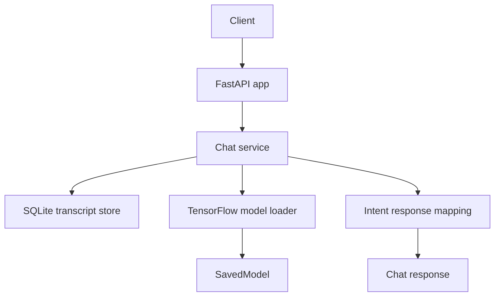
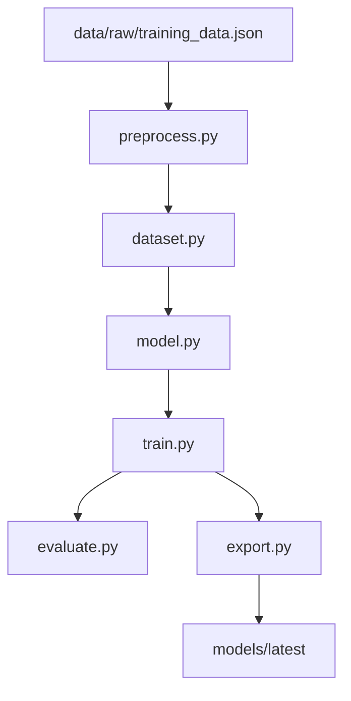

# TensorFlow Chat Agent Starter

A production-minded starter for a **Python AI chat agent** built around a **TensorFlow / Keras intent model**, a **FastAPI backend**, and **SQLite-based conversation storage**.

This repository is designed as an **MVP foundation**: small enough to understand quickly, but structured enough to grow into a real internal assistant, FAQ bot, or support copilot.

## Features

- FastAPI API for chat, health checks, model info, and training
- TensorFlow / Keras text classification pipeline
- Deterministic intent-to-response mapping
- Fallback response path for low-confidence predictions
- SQLite transcript storage for short-term conversational memory
- Versioned TensorFlow model export and runtime loading
- Dockerfile for local containerized deployment
- Starter tests for persistence and inference scaffolding

## Repository layout

```text
chatbot/
├── .env.example
├── Dockerfile
├── README.md
├── TECHNICAL_ARCHITECTURE.md
├── requirements.txt
├── app/
│   ├── __init__.py
│   ├── chat_service.py
│   ├── config.py
│   ├── inference.py
│   ├── main.py
│   ├── memory.py
│   └── schemas.py
├── data/
│   └── raw/
│       └── training_data.json
├── ml/
│   ├── __init__.py
│   ├── dataset.py
│   ├── evaluate.py
│   ├── export.py
│   ├── model.py
│   ├── preprocess.py
│   └── train.py
└── tests/
    ├── test_inference_placeholder.py
    └── test_memory.py
```

## What this project is

This project is a **narrow-scope chat system** that:

1. accepts a user message,
2. retrieves recent conversation context,
3. predicts the user’s intent with a TensorFlow model,
4. maps that intent to a response,
5. falls back safely when confidence is too low, and
6. stores the exchange for future context and retraining.

## What this project is not

This repository does **not** try to be a frontier-scale generative LLM stack.

Out of scope for the starter version:

- large-scale pretraining
- autonomous web agents
- multi-agent orchestration
- RLHF pipelines
- vector database memory
- auth, billing, and multitenancy
- distributed training infrastructure

## Quick start

### 1. Create a virtual environment

```bash
python -m venv .venv
source .venv/bin/activate
```

On Windows:

```powershell
.venv\Scripts\activate
```

### 2. Install dependencies

```bash
pip install -r requirements.txt
```

### 3. Train the model

```bash
python -m ml.train
```

### 4. Start the API

```bash
python -m app.main
```

### 5. Open the API docs

```text
http://127.0.0.1:8000/docs
```

## Example API usage

### Health check

```bash
curl http://127.0.0.1:8000/health
```

### Model info

```bash
curl http://127.0.0.1:8000/model-info
```

### Train from the API

```bash
curl -X POST http://127.0.0.1:8000/train
```

### Chat request

```bash
curl -X POST http://127.0.0.1:8000/chat \
  -H "Content-Type: application/json" \
  -d '{
    "session_id": "demo-user",
    "message": "How do I reset my password?"
  }'
```

## Runtime flow



## Training flow



## Core components

### `app/main.py`
FastAPI entrypoint that exposes public endpoints.

### `app/chat_service.py`
Application orchestration for context loading, inference, fallback selection, transcript writes, and response shaping.

### `app/memory.py`
SQLite transcript persistence and recent-message retrieval.

### `app/inference.py`
TensorFlow model loading, confidence scoring, and response lookup.

### `ml/train.py`
Runs the full training pipeline.

### `ml/model.py`
Defines the TensorFlow / Keras network used for intent classification.

### `ml/export.py`
Exports the trained model and metadata for serving.

## Example training data shape

The starter expects labeled examples and response mappings in `data/raw/training_data.json`.

Typical structure:

```json
{
  "examples": [
    {"text": "How do I reset my password?", "intent": "password_reset"},
    {"text": "I forgot my password", "intent": "password_reset"}
  ],
  "responses": {
    "password_reset": [
      "You can reset your password from the account settings page."
    ]
  },
  "fallback_responses": [
    "I’m not fully sure yet. Could you rephrase that?"
  ]
}
```

## Local development notes

- Train at least once before expecting `/chat` to return model-backed predictions.
- If no exported model exists yet, the API should return a safe error or unavailable state instead of pretending inference is ready.
- SQLite is intentionally used here to keep setup friction low during MVP development.

## Docker

Build the image:

```bash
docker build -t tensorflow-chat-agent .
```

Run the container:

```bash
docker run --rm -p 8000:8000 tensorflow-chat-agent
```

## Testing

Run tests with:

```bash
pytest
```

## My planned roadmap for this project

### Phase 2

- improve training data coverage
- add confidence calibration
- expand response templates
- add structured logging
- replace SQLite with Postgres for higher-scale deployments

### Phase 3

- add semantic retrieval
- add document-grounded responses
- add metrics dashboards
- add auth and rate limiting

### Phase 4

- hybrid retrieval + generation
- tool calling
- human handoff workflow
- role-based access control

## Architecture document

See [TECHNICAL_ARCHITECTURE.md](./TECHNICAL_ARCHITECTURE.md) for a full technical breakdown of the system design, runtime flow, training flow, storage model, deployment model, and extension roadmap.

## License

Add the license of your choice before publishing publicly.
