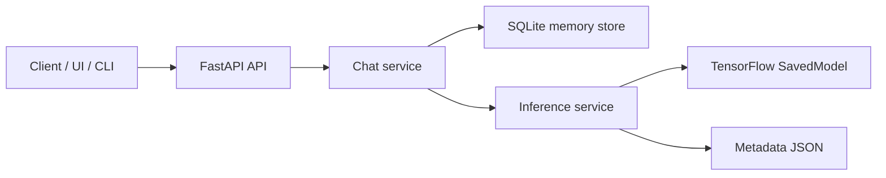
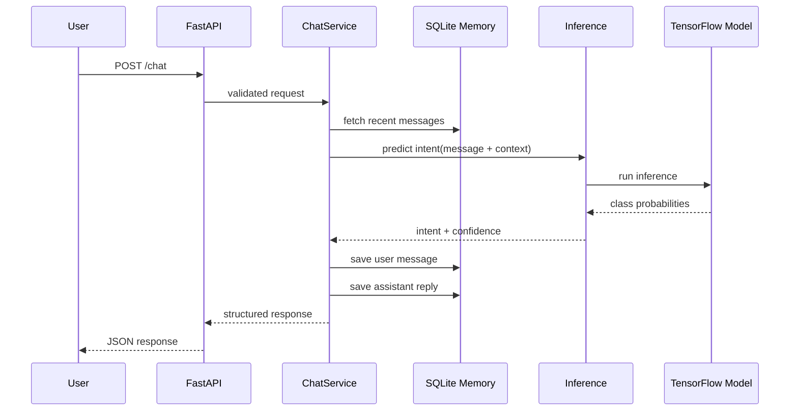
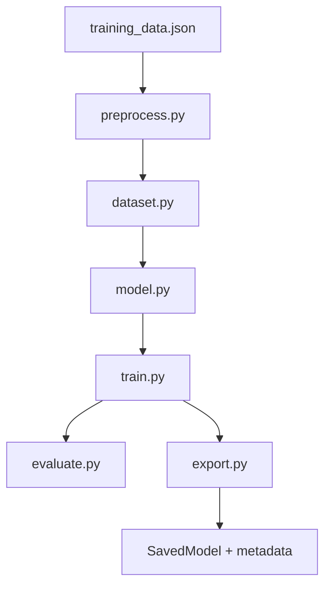
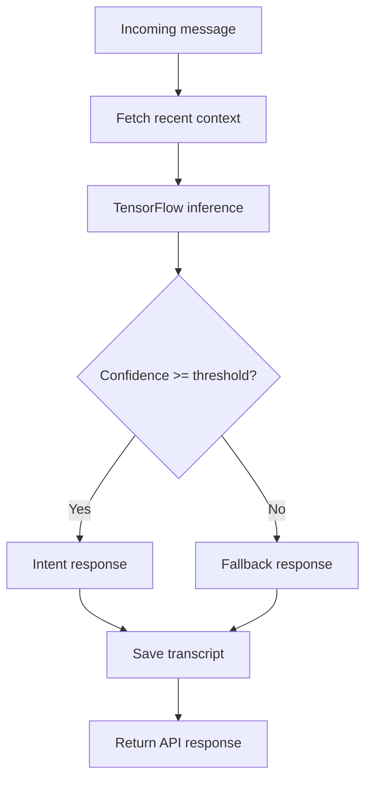

# Technical Architecture

## Overview

This repository implements an **MVP chat agent architecture** in Python using:

- **FastAPI** for the HTTP API
- **TensorFlow / Keras** for intent classification
- **SQLite** for transcript persistence
- **JSON training data** for starter data management
- **SavedModel export** for deployment-friendly inference

The architecture is intentionally narrow and deterministic. Instead of training a large generative model from scratch, the system predicts a user intent and maps that intent to a curated response. This gives the project a practical path to production while keeping training, debugging, and deployment manageable.

---

## Design goals

### Primary goals

- keep the MVP easy to run locally
- separate application code from ML code
- make retraining straightforward
- keep serving behavior predictable
- preserve conversation history for short-term context and future dataset growth

### Non-goals

- frontier-scale LLM training
- autonomous browsing or tool-using agents
- vector-memory infrastructure
- RLHF or preference optimization pipelines
- enterprise auth and multitenant account systems

---

## System architecture



### Main idea

The application layer handles request validation, short-term memory, and orchestration. The ML layer handles training, export, and model-backed intent prediction. The persistence layer stores transcripts so the service can preserve recent context and capture future training data.

---

## End-to-end request lifecycle



---

## Repository structure

```text
chat_agent_starter/
├── .env.example
├── Dockerfile
├── README.md
├── TECHNICAL_ARCHITECTURE.md
├── requirements.txt
├── app/
│   ├── __init__.py
│   ├── chat_service.py
│   ├── config.py
│   ├── inference.py
│   ├── main.py
│   ├── memory.py
│   └── schemas.py
├── data/
│   └── raw/
│       └── training_data.json
├── ml/
│   ├── __init__.py
│   ├── dataset.py
│   ├── evaluate.py
│   ├── export.py
│   ├── model.py
│   ├── preprocess.py
│   └── train.py
└── tests/
    ├── test_inference_placeholder.py
    └── test_memory.py
```

---

## Application layer

The application layer lives under `app/` and owns runtime behavior.

### `app/main.py`
Responsible for:

- initializing the FastAPI application
- defining public endpoints
- wiring service dependencies into the API

Expected endpoints:

- `GET /health`
- `GET /model-info`
- `POST /train`
- `POST /chat`

### `app/chat_service.py`
Responsible for:

- fetching recent transcript context
- passing user input to inference
- applying confidence thresholds
- selecting deterministic or fallback responses
- saving conversation turns
- returning response metadata to the API layer

### `app/memory.py`
Responsible for:

- initializing the SQLite database
- saving user and assistant turns
- retrieving recent messages for a session
- formatting transcript context for inference or debugging

### `app/inference.py`
Responsible for:

- loading the exported TensorFlow model
- reading metadata that maps intents to responses
- running model predictions
- returning confidence scores and selected intents

### `app/config.py`
Central place for environment-driven configuration such as:

- database location
- model path
- confidence threshold
- API host and port
- transcript lookback length

### `app/schemas.py`
Defines request and response models, typically with Pydantic.

---

## ML layer

The ML layer lives under `ml/` and owns training and export.

### `ml/preprocess.py`
Responsible for:

- reading raw training data
- extracting input texts
- extracting labels
- loading intent-to-response mappings
- normalizing training examples if needed

### `ml/dataset.py`
Responsible for:

- encoding labels into integer ids
- splitting train and validation sets
- keeping label metadata aligned with export artifacts

### `ml/model.py`
Defines the TensorFlow / Keras model.

A simple and effective MVP architecture is:

1. string input layer
2. `TextVectorization`
3. `Embedding`
4. `GlobalAveragePooling1D`
5. dense hidden layer
6. dropout
7. softmax output

This keeps the system fast to train, small to deploy, and easy to inspect.

### `ml/evaluate.py`
Responsible for offline quality checks such as:

- validation accuracy
- per-class precision / recall / F1
- confusion analysis
- classification report generation

### `ml/export.py`
Responsible for writing:

- the TensorFlow `SavedModel`
- metadata describing label classes
- response mappings needed during serving

### `ml/train.py`
Runs the end-to-end training job:

1. load data
2. preprocess examples
3. build datasets
4. train model
5. evaluate model
6. export model and metadata

---

## Data layer

### Training data

Starter training data lives in:

```text
data/raw/training_data.json
```

This file should contain:

- labeled examples
- response templates by intent
- fallback responses

### Transcript data

Conversation history lives in SQLite, for example:

```text
data/transcripts/chat_agent.db
```

A minimal transcript table is enough for the MVP:

```sql
CREATE TABLE transcripts (
    id INTEGER PRIMARY KEY AUTOINCREMENT,
    session_id TEXT NOT NULL,
    role TEXT NOT NULL,
    message TEXT NOT NULL,
    created_at TIMESTAMP DEFAULT CURRENT_TIMESTAMP
);
```

This supports:

- short-term context retrieval
- debugging and QA
- basic analytics
- future retraining data collection

---

## Training architecture



### Training assumptions

The MVP assumes you are solving a **classification** problem, not full open-ended text generation.

### Recommended defaults

- optimizer: Adam
- loss: sparse categorical crossentropy
- metric: accuracy
- callback: early stopping

### Why `TextVectorization` inside the model

Keeping tokenization inside the model graph reduces training-serving drift. The same preprocessing logic used during training is preserved during inference, which simplifies deployment.

---

## Inference architecture



### Returned response shape

A useful structured response usually includes:

- `reply`
- `predicted_intent`
- `confidence`
- `used_fallback`
- `context_messages`

That structure helps with debugging and evaluation without making the interface complicated.

---

## Why this MVP architecture works

### Intent classification over generation

For an MVP, intent classification is easier to:

- train
- test
- explain
- trust
- maintain

It also creates a clean path toward future upgrades like retrieval or hybrid response generation.

### Deterministic responses

Deterministic replies reduce hallucination risk and make behavior easier to review.

### SQLite for memory

SQLite avoids infrastructure overhead during early development while still giving you persistence, replayability, and local debugging support.

---

## Operational considerations

### Current baseline

The starter architecture assumes:

- local or small-scale deployment
- no auth by default
- no rate limiting by default
- no moderation layer by default
- single-service runtime

### Recommended production upgrades

- API key or OAuth-based auth
- rate limiting
- structured logs
- request correlation ids
- secrets management
- centralized metrics and alerting
- Postgres for production persistence

---

## Observability

Recommended runtime metrics:

- request count by endpoint
- p50 / p95 latency
- model confidence distribution
- fallback rate
- per-intent frequency
- loaded model version
- transcript growth over time

These metrics help identify weak intents, broken deployments, and poor training coverage.

---

## Testing strategy

### Unit tests

Focus on:

- transcript write and read behavior
- response selection logic
- config parsing
- label encoding stability

### Integration tests

Focus on:

- successful model export after training
- inference availability after model load
- `/chat` returning valid JSON
- metadata and model compatibility

### Offline evaluation

Review:

- confusion matrix
- per-intent recall
- hard negative examples
- fallback trigger rate

---

## Deployment model

### Local development

```bash
python -m venv .venv
source .venv/bin/activate
pip install -r requirements.txt
python -m ml.train
python -m app.main
```

### Container deployment

A single Dockerfile is enough for the starter. In a more mature deployment, you would likely split:

- training image
- serving image
- reverse proxy / ingress layer
- external database

---

## Suggested upgrade path

### Phase 2

- larger labeled dataset
- better confidence threshold tuning
- richer response templates
- structured logging
- stronger test coverage

### Phase 3

- semantic retrieval over documents
- embeddings-based search
- admin tooling for retraining
- support analytics

### Phase 4

- hybrid routing between retrieval and generation
- tool invocation
- human escalation workflows
- access control and multi-user governance

---

## Final definition

This repository implements a complete starter architecture for a **TensorFlow-based Python chat agent MVP**:

- trainable
- exportable
- loadable
- deployable
- testable
- extendable

It is intentionally small, but it represents a real end-to-end architecture rather than a one-file demo.
